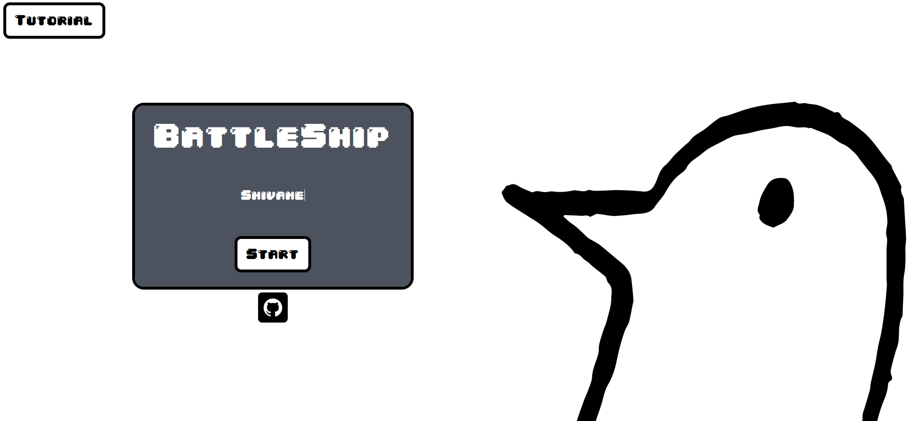
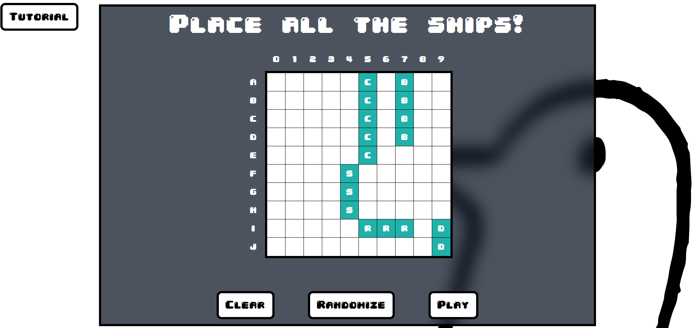
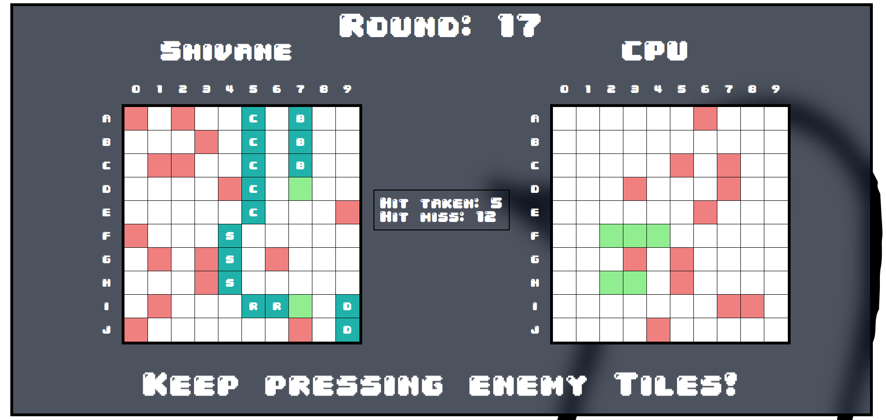

# Battleship Game

A fun, interactive **Battleship** game built using JavaScript, HTML, and CSS. Play against an AI opponent and sink all enemy ships before yours are destroyed!

---

## 🚀 Features
- **Classic Battleship Gameplay** – Place your ships and strategize to sink your opponent's fleet.
- **Modern UI** – Clean and simple design for an enjoyable experience.
- **TDD** - This project is done using TDD with jest as testing system.

---

## Screenshots

### Landing page

### Ship Placement  

### Gameplay Screen  

---

## How to Play
1. **Place Your Ships**: Press Random button to create a random placement of ships.
2. **Take Turns Attacking**: Click on enemy grid spots to fire shots.
3. **Win the Game**: Sink all enemy ships before they sink yours!

---
